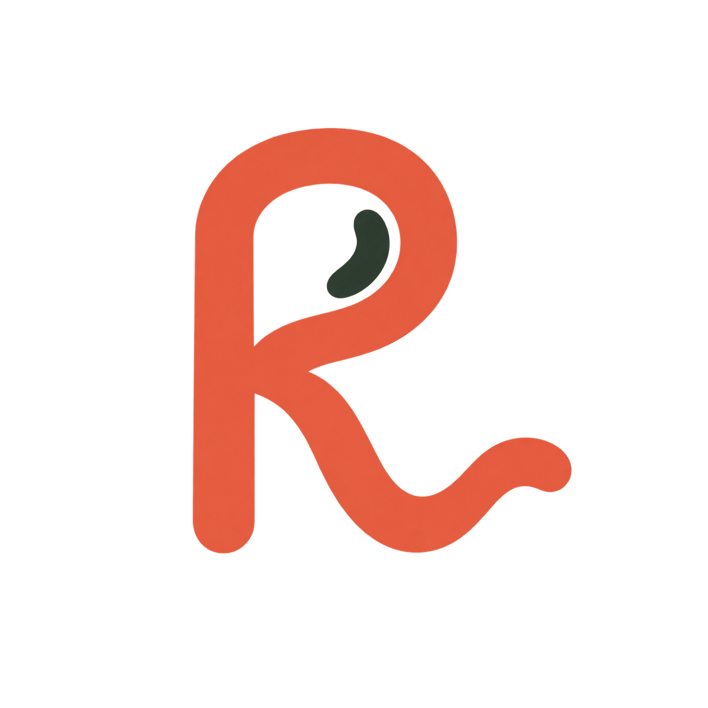

# Ritmo

**Find your rhythm in a new language.**

Ritmo is a language-learning app that combines Anki's proven, learner-controlled spaced repetition with the beauty, warmth, visual engagement, and frictionlessness that make daily language practice inviting.

We are initially building it for learning Mexican Spanish in Mexico City. The first experience will make it enjoyable to manually create beautiful, spoken Spanish ↔ English cards, practice active typed recall, and review them at speed—online or offline.

## Status

Ritmo is in its product-definition phase. The product vision is captured in [docs/PRODUCT_VISION.md](docs/PRODUCT_VISION.md); implementation will follow in later commits.

The included logo is an early concept. It is intentionally treated as a starting point, not a final brand asset.

## Guiding idea

> Make the language you meet every day stick.
