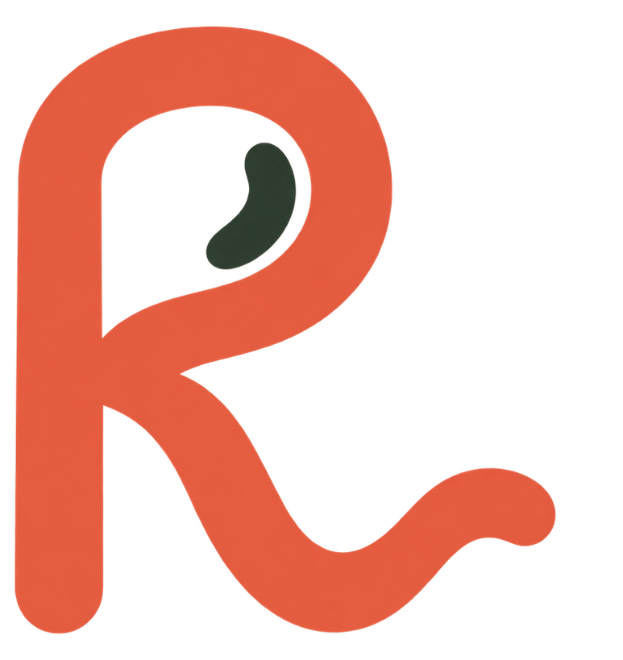

  
    
  <strong>Find your rhythm in a new language.</strong>
    
  

# Ritmo

Ritmo is a multimodal language-learning app that combines Anki's proven, learner-controlled spaced repetition with the beauty, warmth, visual engagement, and frictionlessness that make daily language practice inviting. Each card brings together the written language, meaningful visuals, and natural audio so learners can connect what they read, see, and hear.

We are initially building it for learning Mexican Spanish in Mexico City. The first experience will make it enjoyable to manually create beautiful, spoken Spanish ↔ English cards, practice active typed recall, and review them at speed—online or offline.

## Status

Ritmo is an early prototype. Its direction is captured in [the product vision](docs/PRODUCT_VISION.md), and its engineering standards in [the quality guide](docs/QUALITY.md). See [the development guide](docs/DEVELOPMENT.md) to run it locally.
