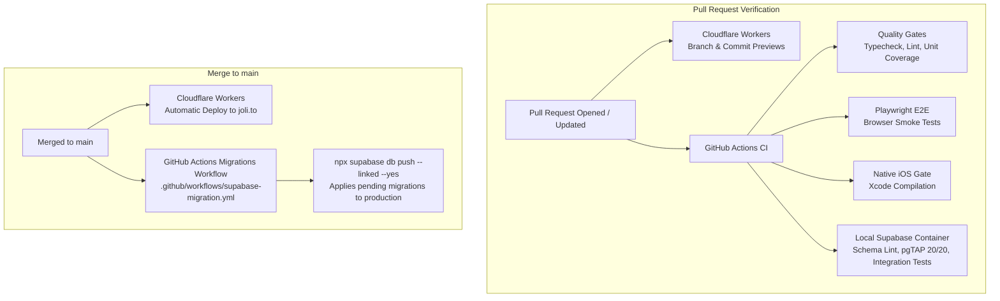

# Developing Jolito

## Prerequisites

- Node.js >=24 (Node 24 LTS / Node 26+)
- npm

## Start the app

```sh
npm ci
npm run dev
```

Open [http://localhost:5173](http://localhost:5173).

For remote development over mosh, follow the README's [Run it locally](../README.md#run-it-locally) section. It is the source of truth for the SSH tunnel command and task-worktree substitution.

The development server does not register the offline service worker, avoiding stale assets while iterating. To exercise the installable, offline-capable production shell locally:

```sh
npm run build
npm run preview
```

Open [http://localhost:4173](http://localhost:4173) once while online before testing an offline reload. Jolito pairs a studio-quality neural voice engine with local service worker caching and practice prefetching, falling back gracefully to device speech synthesis when offline or for un-cached phrases.

## Cloud synchronization & Supabase

Jolito uses Supabase PostgreSQL for multi-device deck replication and passwordless authentication under Supabase's permanent free tier ($0/month).

### Local environment variables

To connect the dev server or local preview build to your Supabase project, copy `.env.example` to `.env.local`:

```sh
cp .env.example .env.local
```

Fill in your project credentials:

```env
VITE_SUPABASE_URL=https://<your-project-ref>.supabase.co
VITE_SUPABASE_ANON_KEY=sb_publishable_...
```

If these variables are omitted, Jolito operates 100% offline with local storage and displays a friendly notice that cloud sync is disabled.

### Configuration as Code & zero manual drift

All application and cloud infrastructure settings are 100% version-controlled in the repository to guarantee reproducible deployments and eliminate manual configuration drift:

- **Database schema & RLS policies ([`supabase/migrations/`](../supabase/migrations/)):** Contains versioned SQL schema migrations with RLS policies ensuring users can only read and write their own deck. Applied automatically in CI and on merge to `main`.
- **Local development settings ([`supabase/config.toml`](../supabase/config.toml)):** Defines local development project settings, ports, site URL, allowed redirect wildcard patterns, token expiry, and local Inbucket passwordless email testing.
- **Hosting & edge Workers ([`wrangler.jsonc`](../wrangler.jsonc)):** Declares Worker configuration, static asset routing, SPA fallback, compatibility flags, and environment bindings.
- **Domain, DNS, email & auth orchestration ([`scripts/setup-domain.ts`](../scripts/setup-domain.ts), [`scripts/setup-email.ts`](../scripts/setup-email.ts)):** Automated, idempotent scripts calling Cloudflare, Spaceship, Resend, and Supabase Management APIs. They configure Cloudflare DNS zones, custom domain bindings (`joli.to`), Resend DKIM/SPF/MX records, Cloudflare Email Routing rules (`signin@joli.to`, `a@joli.to`), and hosted Supabase Auth settings (site URL, redirect URI allowlists, custom Resend SMTP credentials, and transactional email templates).

> [!IMPORTANT]
> Never configure remote services (Cloudflare, Supabase, Resend) via manual dashboard clicks or uncommitted curl commands. Every configuration detail must be codified in version-controlled scripts or configuration files.

### Local Supabase development & integration testing

You can run the full local Supabase Postgres and PostgREST stack via Docker for $0 operating costs:

```sh
# 1. Start local Supabase containers (applies all migrations automatically)
npx supabase start -x realtime,storage-api,imgproxy,studio,logflare,vector,supavisor

# 2. Run pgTAP database tests (verifies tables and PostgreSQL RLS policies; 20 assertions)
npm run test:db

# 3. Lint local database schema
npm run lint:db

# 4. Run live integration test suite (verifies guest/authenticated feedback & sync against local PostgREST)
npm run test:integration

# 5. Stop local Supabase when done
npx supabase stop
```

## Deployment & continuous delivery

Jolito uses a dual, strictly zero-cost continuous delivery architecture: static web assets and edge endpoints build and deploy to Cloudflare Workers, while PostgreSQL schema migrations and Row-Level Security policies deploy to Supabase Cloud via GitHub Actions.



### GitHub Actions secrets reference

Automated schema deployment on merge to `main` relies on GitHub repository secrets (**Settings > Secrets and variables > Actions**):

| Secret                  | Required | Purpose                                                        | Source / Notes                                                |
| :---------------------- | :------- | :------------------------------------------------------------- | :------------------------------------------------------------ |
| `SUPABASE_ACCESS_TOKEN` | **Yes**  | Authenticates Supabase CLI via Management API                  | Generated at Supabase Dashboard > Account > Access Tokens     |
| `SUPABASE_PROJECT_ID`   | **Yes**  | Identifies hosted project reference (`xwqjelkfdcfzyxxblvhp`)   | Project ref in Supabase Dashboard (or `SUPABASE_PROJECT_REF`) |
| `SUPABASE_DB_PASSWORD`  | No       | Database password if connecting directly via connection string | Optional; linking and migrations use Management API           |

> [!NOTE]
> If these secrets are omitted (e.g. in a personal fork), the migration deployment step on `main` emits an informative warning and cleanly skips execution rather than breaking the build on `main`.

### Automated CI/CD database migrations & checks

To prevent database drift and guarantee zero unapplied schema changes:

1. **Pull Requests (`.github/workflows/supabase-migration.yml`):**
   - Spins up a minimal local Supabase container (PostgreSQL + PostgREST + GoTrue Auth) with unused auxiliary services disabled to preserve speed and memory.
   - Applies migrations from scratch and lints schema via `npm run lint:db`.
   - Runs 20 pgTAP test assertions (`npm run test:db`) verifying table columns and RLS permission matrices.
   - Runs live HTTP integration tests (`npm run test:integration`) verifying guest/authenticated feedback and deck sync.
   - Performs a non-mutating `supabase db push --dry-run` when repository secrets are present.
2. **Merge to `main`:** Automatically deploys new SQL migrations using `npx supabase db push --linked --yes`.
3. **Local Supabase in PR Quality Gates (`.github/workflows/quality.yml`):** Every pull request runs the `supabase-integration` job, executing real Playwright E2E form submissions against the local PostgREST backend alongside pure in-memory unit tests.

### Cloudflare deployment

The [production app](https://joli.to) tracks `main` through Cloudflare Workers Git integration. Cloudflare runs `npm run build`, then:

- `npx wrangler deploy` for `main`;
- `npx wrangler versions upload` for every non-production branch.

For each non-production branch, Cloudflare posts a stable branch preview and an immutable commit preview on its pull request. The branch link follows new commits; the commit link identifies one exact deployment.

The checked-in [Wrangler configuration](../wrangler.jsonc) owns the Worker name, compatibility date, static `dist/` assets, and single-page-app fallback. The equivalent local commands are `npm run deploy` and `npm run deploy:preview`; use Wrangler's `--dry-run` option to validate them without credentials or an upload.

The Cloudflare DNS zone, edge TLS settings, custom domain bindings for `joli.to`, Spaceship nameserver delegation, and Supabase auth sync can be provisioned in one automated command:

```sh
npm run setup:domain
```

To configure or re-provision Cloudflare Email Routing (verifying destination address, provisioning MX/SPF DNS records, and activating forwarding rules for `a@joli.to` and `signin@joli.to`) independently without running the full registrar pipeline:

```sh
npm run setup:email
```

### Passwordless Authentication & Sign-in Emails

Jolito uses Supabase Auth for passwordless 1-click magic link and 6-digit OTP verification.

1. **Email Templates:** The custom responsive email template is version-controlled at [`supabase/templates/magic_link.html`](../supabase/templates/magic_link.html) and configured in `supabase/config.toml` (`[auth.email.template.magic_link]`). It features:
   - Official Jolito brand badge with dark-mode contrast protection.
   - Primary 1-click login button (`{{ .ConfirmationURL }}`).
   - Prominent letter-spaced 6-digit OTP code (`{{ .Token }}`) with explicit verification code phrasing and domain-bound security format (`@joli.to #{{ .Token }}`) for OS AutoFill detection.
   - Dynamic subject line: `Your Jolito verification code is {{ .Token }}`.
   - Inlined CSS with dark mode support (`prefers-color-scheme: dark`) and inbox preheader text to prevent snippet leakage.
2. **Sender Domain (`signin@joli.to`) via Custom SMTP:**
   - Transactional authentication emails route through Resend SMTP (`smtp.resend.com`) from `signin@joli.to`.
   - **Automated sync:** `npm run setup:domain` provisions the Resend domain, syncs DKIM/SPF DNS records to Cloudflare, and applies custom SMTP settings (`smtp_host`, `smtp_port`, `smtp_admin_email`, `smtp_sender_name`, `smtp_user`, `smtp_pass`) and the branded magic link template directly to the hosted Supabase project via the Supabase Management API.
   - **Zero manual drift:** In accordance with the 100% config-as-code invariant, never manually edit SMTP settings or email templates in the Supabase Dashboard. All remote settings are codified in [`scripts/setup-domain.ts`](../scripts/setup-domain.ts).
3. **Inbound Reply Forwarding:** Running `npm run setup:email` (or `npm run setup:domain`) provisions Cloudflare Email Routing rules for `signin@joli.to` and `a@joli.to`, ensuring user replies to auth emails route directly to the maintainer destination inbox.

Preview deployments are public. Do not expose secrets, credentials, personal information, or production data through previews as backend bindings are added. The Cloudflare check is intentionally optional so a deployment-provider outage cannot block an otherwise healthy merge; the quality, browser, and iOS native compilation checks remain the code-quality gates.

## Native iOS & Mobile development

Jolito uses [Capacitor](https://capacitorjs.com/) to package the application as a native iOS app sharing the core local-first architecture, sensory feedback (haptics), and spaced-repetition loop.

### Syncing web assets to the native Xcode project

```sh
npm run build
npm run cap:sync
```

### Opening in Xcode (macOS)

```sh
npm run cap:ios
```

### Running Native Simulator & Touch E2E Tests

```sh
npm run test:e2e                # runs full desktop and mobile touch target audits
# On macOS with Xcode Simulator:
maestro test tests/native/smoke.yaml
```

### Releasing to TestFlight and the App Store

Follow the [App Store Release Guide](APP_STORE.md) for enrollment, signing,
production configuration, listing assets, and physical-device validation.
The release workflows are manually dispatched on main: TestFlight builds and
signs one candidate; App Store submission selects its exact tested build
number without rebuilding. Native simulator screenshot artifacts come from
the iOS CI workflow. Browser screenshots are not App Store release assets.

## Before opening a PR

```sh
npm run check
npm run test:e2e
```

Use the narrowest useful command while iterating (`npm run test`, `npm run lint`, or `npm run typecheck`), then run the full checks before review. See [QUALITY.md](QUALITY.md) for the test strategy and quality contract.
