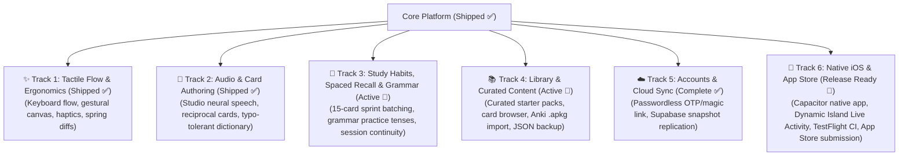

# Jolito Product Roadmap

Jolito combines Anki's spaced-repetition efficiency with the warmth, tactile flow, and audio immersion of a modern practice app.

Our architecture decouples core domain logic from UI and infrastructure, organizing development across six tracks:

---

> [!NOTE]
> Tracks capture active outcomes and technical directions. Exact UX, data models, and trade-offs are defined test-first in isolated worktrees as each track advances.

---

## Capability Tracks

### Track 1: ✨ Tactile Flow & Ergonomics

_Goal: Create a calm, distraction-free study environment that feels tactile, rhythmic, and effortless._

- **Calm, Focused Canvas (Complete ✅):** Minimalist visual hierarchy, warm palette, unified Practice CTA, and clean typography that leaves the learner entirely in flow.
- **Keyboard-First Review (Complete ✅):** Fly through reviews with `Enter` to reveal, `1`–`4` to grade, and `Space` for audio playback, with automatic input focus.
- **Native Gestural Canvas (Complete ✅):** Smooth swipe-up to reveal and horizontal swipe to grade on mobile, tuned with continuous spring settling and cue morphing.
- **Audio Cues / Earcons (Complete ✅):** Pleasant synthesized Web Audio cues for reveals, self-grading, and session completion that reinforce momentum without breaking concentration.
- **Tactile Haptics (Complete ✅):** Native vibration patterns on iOS via `@capacitor/haptics` for card reveals and self-grading feedback.
- **Physical Keyboard Detection (Complete ✅):** Dynamic shortcut display that reveals key hints only when a physical keyboard is attached on iPad/iPhone.

---

### Track 2: 🎨 Audio & Card Authoring

_Goal: Turn any real-world phrase heard on the street into a rich, spoken card in seconds._

- **Neural Voice Synthesis (Complete ✅):** Studio-quality Mexican Spanish voices (`/api/tts`) alternating male and female speakers, with practice prefetching, service worker caching, and graceful offline device speech synthesis fallback.
- **Bundled Dictionary & Autocomplete (Complete ✅):** Instant offline translations, lemmas, and verb conjugations powered by a bundled Mexican Spanish lexicon with trie-based approximate autocomplete for typo tolerance ([`OfflineCardAssistant`](../src/application/card-assistant.ts)).
- **Reciprocal Dual Cards (Complete ✅):** Create and edit reciprocal Spanish ↔ English cards simultaneously with side-by-side previews and independent prompt/answer overrides.
- **Duplicate Detection (Complete ✅):** Real-time duplicate matching and in-place resolution across creation, deck management, and editing.
- **Contextual Visuals (Planned):** Culturally grounded scene illustrations that anchor phrase meaning and context.
- **Remote AI Enrichment (Planned):** Generative CDMX cultural context notes, usage registers, and scene imagery enrichment when online.

---

### Track 3: 🧠 Study Habits, Spaced Recall & Grammar

_Goal: Keep daily practice sessions concise, predictable, and educationally effective._

- **Focused Grammar Practice (Complete ✅):** Dedicated, bite-sized training for tricky Mexican Spanish conjugations—Pretérito Indefinido, Pretérito Perfecto Compuesto, and Gerundio—with numbered accent shortcuts and subject-verb matching.
- **Sprint Study Batching & Instant Re-test (Complete ✅):** 15-card review sprints prioritizing overdue cards, with failed cards resurfacing 5 cards ahead for immediate spaced retrieval.
- **Active Session Continuity (Complete ✅):** Study sessions seamlessly preserve and resume active card batches across view changes without progress loss.
- **Auditory Reinforcement (Complete ✅):** Automatic pronunciation playback upon answer reveal to reinforce auditory memory.
- **Configurable Intake & Queue Controls (Planned):** User-configurable daily new-card intake caps and advanced queue prioritization.
- **Retention & Habit Insights (Planned):** Clean, encouraging visibility into retention curves, spaced-repetition intervals, and daily practice streaks.

---

### Track 4: 📚 Library & Curated Content

_Goal: Provide complete learner autonomy over cards, tags, and collections, paired with high-quality starter packs._

- **Curated Mexican Spanish Starter Packs (Complete ✅):** Hand-crafted starter decks (Top Connectors, Top Adjectives, Top Idioms, Top Adverbs) that merge semantically into personal decks without overwriting user progress.
- **Card Browser & Fast Editing (Complete ✅):** Searchable, filterable library view with instant editing, creation date and alphabetical sorting, and duplicate resolution.
- **Anki Deck & Note Import (Complete ✅):** Full `.apkg` (SQLite collection parsing) and text export import, preserving learning history, intervals, and spaced-repetition schedules.
- **Offline JSON Backup & Restore (Complete ✅):** Complete deck export, backup download, and conflict-free restore/merge ([ADR 0004](adr/0004-offline-deck-backup-and-export.md)).
- **Contextual Tags (Planned):** Lightweight user-defined tagging by topic, situation, or register (imported Anki tags are preserved in card context notes).
- **Anki Collection Export (Planned):** Exporting Jolito decks to `.apkg` packages.

---

### Track 5: ☁️ Accounts & Multi-Device Sync

_Goal: Ensure cards and progress are safely backed up and synced without sacrificing offline capability._

- **Passwordless Sign-In (Complete ✅):** 6-digit email OTP and 1-click magic link auto-login with zero backend friction.
- **Zero-Cost Snapshot Sync (Complete ✅):** Automatic cloud snapshot replication and deterministic reconciliation to PostgreSQL with Row-Level Security under Supabase's permanent free tier ([ADR 0005](adr/0005-cloud-snapshot-sync-supabase.md)).
- **In-App Feedback (Complete ✅):** Authenticated user feedback modal submitting directly to backend with email routing.
- **Incremental Replication (Future):** PowerSync / operation-log sync ([ADR 0003](adr/0003-offline-sync-evaluation.md)) when fine-grained multi-device concurrent editing is needed.

---

### Track 6: 📱 Native iOS Client & Ecosystem

_Goal: Bring Jolito's calm study flow to iOS with tactile polish, Dynamic Island integration, and App Store distribution._

- **Native Mobile Packaging & TestFlight CI (Complete ✅):** Capacitor app packaging (`ios/App`) sharing the core local-first React web application, local storage, and offline service worker, with automated Xcode and Fastlane TestFlight distribution.
- **Dynamic Island & Live Activity (Complete ✅):** Native iOS `ActivityKit` widget tracking practice session progress on Lock Screen and Dynamic Island.
- **Tactile Haptics (Complete ✅):** Native tactile feedback via `@capacitor/haptics` for card reveals and self-grading.
- **App Store Release ($2.99 once) (In Verification 🚀):** Production pricing schedule ($2.99 once, free web app), review metadata, and release automation codified in `fastlane/release.json` ([APP_STORE.md](APP_STORE.md)).
- **Apple Sign-In (Planned):** Native iOS authentication flow integrating with Supabase Auth.
- **Home & Lock Screen Widgets (Planned):** Quick-review and streak widgets on iOS.

---

## Invariants & Quality Standards

All tracks must preserve core architecture invariants from [`docs/ARCHITECTURE.md`](ARCHITECTURE.md#core-invariants):

1. **Strictly $0.00 operating costs**
2. **Local-first & offline by default**
3. **Keyboard-first & accessible (zero WCAG violations)**
4. **Never fail silently**
5. **Validate boundaries with Zod**
6. **Data migrations are mandatory**
7. **Visual verification is mandatory**
