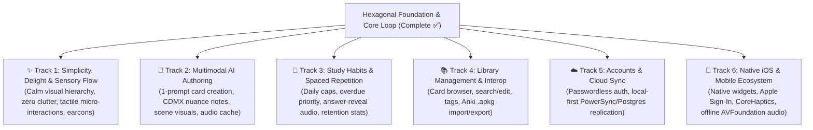

# Ritmo Product Roadmap

Ritmo aims to combine Anki's proven spaced-repetition efficiency with the beauty, warmth, and effortless daily flow that makes language practice an addictive pleasure.

Our hexagonal architecture decouples core domain logic from UI and infrastructure, allowing development across **six parallel capability tracks** without waterfall bottlenecks.

---

## Capability Tracks

### Track 1: ✨ Simplicity, Delight & Sensory Flow

_Goal: Create a calm, distraction-free study environment that feels tactile, rhythmic, and deeply enjoyable._

- **Calm, Distraction-Free Simplicity:**
  - Zen-like study focus with zero visual noise, clutter, or gamified busywork.
  - Deep visual coherence: refined typography, intentional whitespace, warm CDMX-inspired palette, and clear visual hierarchy.
- **Rhythmic Micro-Interactions:**
  - Tactile keystroke responses, springy card transitions, smooth token diff reveals with zero layout jank.
  - Frictionless keyboard navigation (`Enter`, `1`–`4`, `Space`) with seamless focus management.
- **Audio Feedback (Earcons):**
  - Subtle, high-production sound cues for grading and reveals to reinforce flow without breaking concentration.
- **Earned Celebration:**
  - Tasteful, motivating session completion (`¡Hecho!`) celebrating genuine daily momentum.
- **Mobile Touch Polish:**
  - Ergonomic thumb-zone touch targets, swipe gestures, and responsive layouts.

---

### Track 2: 🎨 Multimodal AI Authoring

_Goal: Turn any real-world phrase heard on the street into a rich, multimodal card in seconds._

- **Single-Prompt Card Generation:**
  - Learner types a single Spanish phrase → AI generates idiomatic English translation, CDMX cultural/regional nuance notes, and linked asymmetric reverse cards.
- **Contextual Visuals:**
  - Curated and generated contextually accurate scene illustrations that anchor memories.
- **Offline Audio Synthesis:**
  - High-fidelity natural Mexican Spanish speech generation with client caching (IndexedDB/Cache API) for 100% offline playback.

---

### Track 3: 🧠 Study Habits & Spaced Repetition Mechanics

_Goal: Keep daily practice sessions concise, predictable, and educationally sound._

- **Daily Queue Scheduling:**
  - Configurable daily new-card limit (default 20/day) with prioritized overdue cards.
- **Answer Audio on Reveal:**
  - Automatic audio playback of the target phrase upon reveal to reinforce auditory memory.
- **Learning Retention & Streaks:**
  - Clean retention curves, review count milestones, and habit tracking.

---

### Track 4: 📚 Library Management & Interoperability

_Goal: Provide complete learner control over cards and collections._

- **Searchable Card Browser:**
  - Fast filterable card list with instant search and inline editing.
- **Contextual Tagging:**
  - Lightweight categories (`restaurante`, `transporte`, `mercado`, `calle`, `argot`).
- **Anki Interoperability:**
  - Full `.apkg` deck import and export.

---

### Track 5: ☁️ Accounts & Multi-Device Sync

_Goal: Ensure cards and progress are safely backed up and synced without sacrificing offline capability._

- **Seamless Authentication:**
  - Passwordless magic links and Google OAuth.
- **Local-First Cloud Synchronization:**
  - Background database replication (PowerSync / Postgres) as evaluated in [ADR 0003](adr/0003-offline-sync-evaluation.md).
  - Offline-first durability: local reads and writes remain immediate; sync happens quietly in the background when connected.

---

### Track 6: 📱 Native iOS Client & Mobile Ecosystem

_Goal: Bring Ritmo's calm, rhythmic study flow to iOS with native tactile polish and instant widget access._

- **Native iOS Experience (SwiftUI / Shared Core):**
  - High-performance, offline-first client sharing the synchronized collection.
  - Native AVFoundation audio playback with background session handling and offline caching.
- **System Integrations:**
  - Interactive Home Screen & Lock Screen widgets for quick review reminders and daily streaks.
  - Apple Sign-In authentication.
  - CoreHaptics tactile feedback on grading gestures (`1`–`4`) and card reveals.
- **Local-First Native Sync:**
  - Embedded local SQLite database replicated in the background via PowerSync/Postgres.

---

## Invariants & Quality Standards

All tracks must preserve repository invariants from [`AGENTS.md`](../AGENTS.md):

1. **Local-first & offline by default**
2. **Keyboard-first & accessible (zero WCAG violations)**
3. **Never fail silently**
4. **Validate boundaries with Zod**
5. **Data migrations are mandatory**
