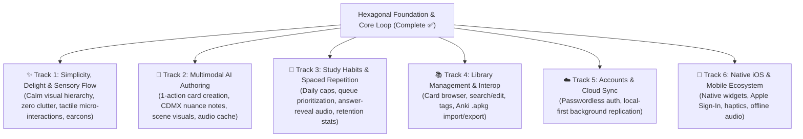

# Jolito Product Roadmap

Jolito aims to combine Anki's proven spaced-repetition efficiency with the beauty, warmth, and effortless daily flow that makes language practice an addictive pleasure.

Our hexagonal architecture decouples core domain logic from UI and infrastructure, allowing development across **six parallel capability tracks** without waterfall bottlenecks.

---

> [!NOTE]
> **How to read this roadmap:** This document outlines the problem spaces, high-level goals, and capability areas needed to achieve Jolito's north star. The items within each track represent intended outcomes and reference directions, not rigid implementation prescriptions. Exact UX designs, technical choices, and trade-offs are defined test-first within dedicated worktrees when each track is actively explored.

---

## Capability Tracks

### Track 1: ✨ Simplicity, Delight & Sensory Flow

_Goal: Create a calm, distraction-free study environment that feels tactile, rhythmic, and deeply enjoyable._

- **Calm, Clutter-Free Focus:** Minimalist visual hierarchy, generous whitespace, warm palette, and zero distracting busywork or visual noise during study.
- **Rhythmic Responsiveness:** Physical, springy micro-interactions, smooth keystroke responses, and fluid token diff reveals with zero layout jank.
- **Auditory Flow (Earcons):** Subtle, pleasant sound cues for reveals and grading that reinforce momentum without breaking concentration.
- **Tasteful Celebration:** Motivating, clean session completion (`¡Hecho!`) celebrating genuine daily practice consistency.
- **Mobile Ergonomics:** Thumb-friendly touch targets, natural gestures, and fluid responsive layouts.

---

### Track 2: 🎨 Multimodal AI Authoring

_Goal: Turn any real-world phrase heard on the street into a rich, multimodal card in seconds._

- **One-Action Card Creation:** Enter a single Spanish phrase or chunk → automatically suggest natural translations, cultural context, and reverse cards while leaving full authoring control to the learner.
- **Contextual Visuals:** Clean, culturally grounded scene illustrations that anchor phrase meaning and context.
- **Offline Natural Audio:** High-quality natural pronunciation audio cached locally for immediate, 100% offline study.

---

### Track 3: 🧠 Study Habits & Spaced Repetition Mechanics

_Goal: Keep daily practice sessions concise, predictable, and educationally effective._

- **Predictable Daily Load:** Configurable daily new-card intake with smart queue prioritization (overdue reviews first).
- **Auditory Reinforcement on Recall:** Automatic pronunciation playback upon answer reveal to reinforce auditory memory.
- **Retention & Habit Insights:** Clear, encouraging visibility into retention rates and daily review consistency.

---

### Track 4: 📚 Library Management & Interoperability

_Goal: Provide complete learner autonomy over cards, tags, and collections._

- **Card Browser & Fast Editing:** Searchable, filterable library view with instant editing and card state management.
- **Contextual Organization:** Lightweight tagging by topic, situation, or register.
- **Anki Interoperability:** Import and export capabilities for Anki collections (`.apkg`) and media.

---

### Track 5: ☁️ Accounts & Multi-Device Sync

_Goal: Ensure cards and progress are safely backed up and synced without sacrificing offline capability._

- **Frictionless Accounts:** Simple passwordless email and OAuth paths.
- **Local-First Cloud Synchronization:** Seamless background multi-device replication (e.g. via PowerSync/Postgres as evaluated in [ADR 0003](adr/0003-offline-sync-evaluation.md)) where local reads and writes remain instant and offline by default.

---

### Track 6: 📱 Native iOS Client & Mobile Ecosystem

_Goal: Bring Jolito's calm, rhythmic study flow to iOS with native tactile polish and instant widget access._

- **Native Mobile Experience:** High-performance native or hybrid client sharing the synchronized collection with background-resilient audio playback.
- **System Integrations:** Quick-review Home/Lock Screen widgets, Apple Sign-In, and tactile haptic feedback.
- **Offline Native Storage:** Local embedded database with background cloud synchronization.

---

## Invariants & Quality Standards

All tracks must preserve repository invariants from [`AGENTS.md`](../AGENTS.md):

1. **Local-first & offline by default**
2. **Keyboard-first & accessible (zero WCAG violations)**
3. **Never fail silently**
4. **Validate boundaries with Zod**
5. **Data migrations are mandatory**
