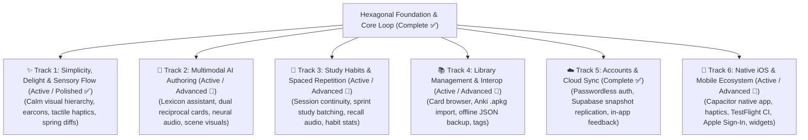

# Jolito Product Roadmap

Jolito aims to combine Anki's proven spaced-repetition efficiency with the beauty, warmth, and effortless daily flow that makes language practice an addictive pleasure.

Our hexagonal architecture decouples core domain logic from UI and infrastructure, allowing development across **six parallel capability tracks** without waterfall bottlenecks.

---

> [!NOTE]
> **How to read this roadmap:** This document outlines the problem spaces, high-level goals, and capability areas needed to achieve Jolito's north star. The items within each track represent intended outcomes and reference directions, not rigid implementation prescriptions. Exact UX designs, technical choices, and trade-offs are defined test-first within dedicated worktrees when each track is actively explored.

---

## Capability Tracks

### Track 1: ✨ Simplicity, Delight & Sensory Flow

_Goal: Create a calm, distraction-free study environment that feels tactile, rhythmic, and deeply enjoyable._

- **Calm, Clutter-Free Focus (Complete ✅):** Minimalist visual hierarchy, generous whitespace, warm palette, unified Practice CTA, and uncluttered navigation that leaves the learner entirely in flow.
- **Rhythmic Responsiveness (Complete ✅):** Physical, springy micro-interactions, smooth keystroke responses, and fluid token diff reveals with affine gap alignment and case-insensitivity.
- **Auditory Flow / Earcons (Complete ✅):** Pleasant, synthesized Web Audio sound cues for reveals, self-grading, and session completion that reinforce momentum without breaking concentration.
- **Sensory Haptics (Complete ✅):** Native tactile vibration patterns on iOS via `@capacitor/haptics` for card reveals and self-grading feedback.
- **Tasteful Celebration (Complete ✅):** Motivating, clean session completion (`¡Hecho!`) celebrating genuine daily practice consistency.
- **Mobile Ergonomics (Complete ✅):** Thumb-friendly touch targets, natural gestures, keyboard accessory bar arrow navigation on iOS, and fluid responsive layouts.

---

### Track 2: 🎨 Multimodal AI Authoring

_Goal: Turn any real-world phrase heard on the street into a rich, multimodal card in seconds._

- **Lexicon-Assisted Card Creation (Complete ✅):** Enter a Spanish phrase or word → instant local autocomplete, translation suggestions, and definition lookups powered by a bundled Mexican Spanish lexicon with lemma resolution and verb-conjugation ranking ([`OfflineCardAssistant`](../src/application/card-assistant.ts)).
- **Live Reciprocal Dual-Card Creation (Complete ✅):** Edit reciprocal Spanish ↔ English cards simultaneously with side-by-side previews and independent prompt/answer overrides.
- **Duplicate Recognition & Resolution (Complete ✅):** Proactive duplicate detection and in-place resolution across creation, deck management, and editing.
- **Studio Neural Voice & Audio Caching (Complete ✅):** High-fidelity neural voice engine with practice prefetching, voice cycling, bundled neural audio for sample cards, and service worker caching for 100% offline study.
- **Contextual Visuals (Planned):** Clean, culturally grounded scene illustrations that anchor phrase meaning and context.
- **Remote LLM Multimodal Authoring (Planned):** Generative CDMX cultural context notes, usage registers, and scene imagery enrichment when connectivity is available.

---

### Track 3: 🧠 Study Habits & Spaced Repetition Mechanics

_Goal: Keep daily practice sessions concise, predictable, and educationally effective._

- **Active Session Continuity (Complete ✅):** Study sessions seamlessly preserve and resume active card batches across view navigation without progress loss.
- **Sprint Study Batching & Progress Sync (Complete ✅):** Focused study sprints with overdue review prioritization and cross-device daily progress replication.
- **Auditory Reinforcement on Recall (Complete ✅):** Automatic pronunciation playback upon answer reveal to reinforce auditory memory.
- **Configurable Intake & Queue Controls (In Progress / Planned):** User-configurable daily new-card intake caps and advanced queue prioritization.
- **Retention & Habit Insights (Planned):** Clear, encouraging visibility into retention curves, spaced-repetition intervals, and daily practice streaks.

---

### Track 4: 📚 Library Management & Interoperability

_Goal: Provide complete learner autonomy over cards, tags, and collections._

- **Card Browser & Fast Editing (Complete ✅):** Searchable, filterable library view with instant editing, creation date and alphabetical sorting, and duplicate resolution.
- **Anki Deck & Note Import (Complete ✅):** Full `.apkg` (SQLite collection parsing) and text export import, preserving learning history, intervals, and spaced-repetition schedules.
- **Offline JSON Backup & Restore (Complete ✅):** Complete deck export, backup download, and conflict-free restore/merge ([ADR 0004](adr/0004-offline-deck-backup-and-export.md)).
- **Contextual Organization (Planned):** Lightweight user-defined tagging by topic, situation, or register (imported Anki tags are preserved in card context notes).
- **Anki Collection Export (Planned):** Exporting Jolito decks to `.apkg` packages.

---

### Track 5: ☁️ Accounts & Multi-Device Sync

_Goal: Ensure cards and progress are safely backed up and synced without sacrificing offline capability._

- **Frictionless Accounts (Complete ✅):** Passwordless email OTP and 1-click magic link auto-login with zero backend friction.
- **Zero-Cost Snapshot Sync (Complete ✅):** Automatic cloud snapshot replication and deterministic reconciliation to PostgreSQL with Row-Level Security under Supabase's permanent free tier ([ADR 0005](adr/0005-cloud-snapshot-sync-supabase.md)).
- **In-App User Feedback (Complete ✅):** Lightweight, authenticated user feedback modal and direct storage in Supabase.
- **Incremental Replication (Future):** PowerSync / operation-log sync ([ADR 0003](adr/0003-offline-sync-evaluation.md)) when fine-grained multi-device concurrent editing is needed.

---

### Track 6: 📱 Native iOS Client & Mobile Ecosystem

_Goal: Bring Jolito's calm, rhythmic study flow to iOS with native tactile polish and instant widget access._

- **Native Mobile Experience via Capacitor (Complete ✅):** Native iOS app packaging (`ios/App`) sharing the core local-first React web application, local storage, and offline service worker.
- **Sensory Haptics (Complete ✅):** Native tactile feedback via `@capacitor/haptics` for card reveals and self-grading.
- **Automated Native Toolchain & CI (Complete ✅):** Xcode compilation validation in GitHub Actions (`macos-15`), Fastlane TestFlight distribution, and Maestro native test support.
- **Apple Sign-In (Next):** Native iOS authentication flow integrating with Supabase Auth.
- **Native Widgets & Extensions (Planned):** Quick-review Lock Screen and Home Screen widgets.

---

## Invariants & Quality Standards

All tracks must preserve core architecture invariants from [`docs/ARCHITECTURE.md`](ARCHITECTURE.md#core-invariants):

1. **Strictly $0.00 operating costs**
2. **Local-first & offline by default**
3. **Keyboard-first & accessible (zero WCAG violations)**
4. **Never fail silently**
5. **Validate boundaries with Zod**
6. **Data migrations are mandatory**
7. **Visual verification is mandatory**
