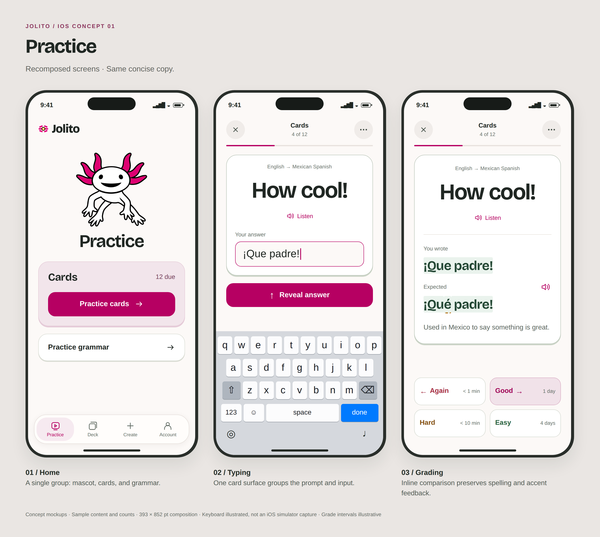
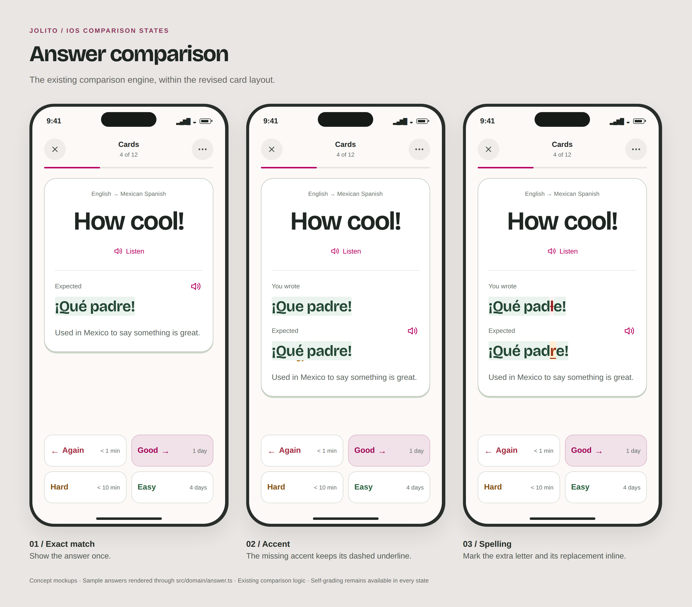
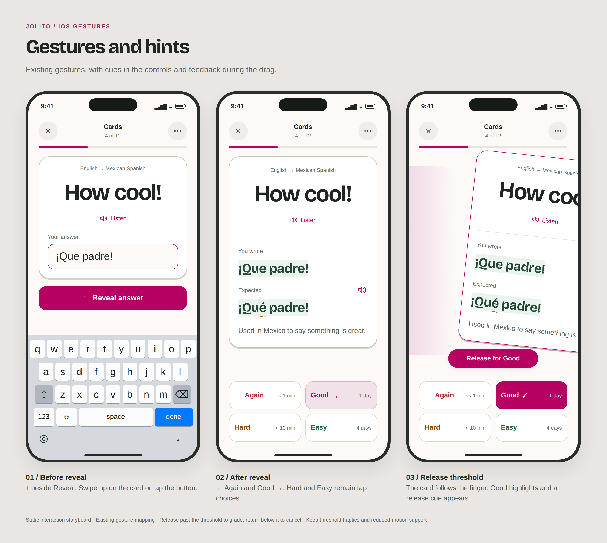
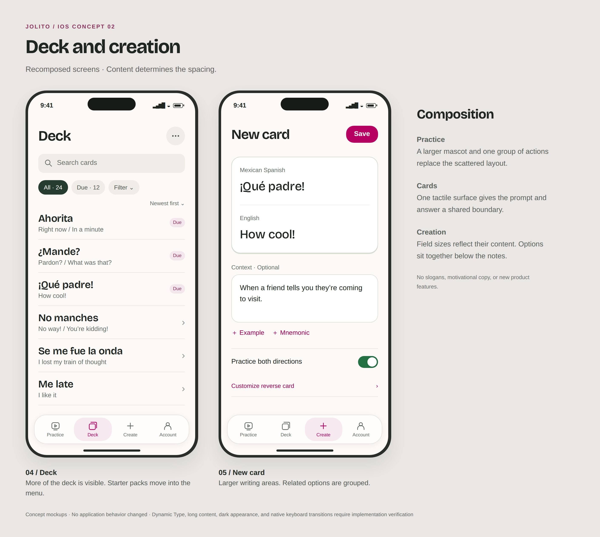
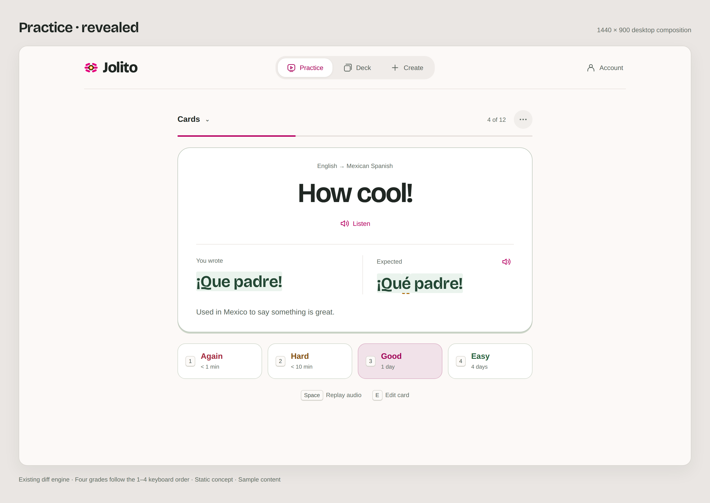

# Visual design concept: iOS and desktop

**Status: exploratory concept. No implementation is approved, scheduled, or committed.**

This document archives a September 2026 design discussion and its final mockups.
Merging this document would preserve the exploration; it would not approve the
proposed UI. Any implementation would require a separate decision and PR. The
ideas may be adopted selectively, revised, or discarded.

The existing [design principles](../../DESIGN.md) and
[architecture invariants](../../ARCHITECTURE.md#core-invariants) remain authoritative.
These images are discussion material, not a new design system or specification.

## What the concept explores

The visual review started from commit
[`309af23`](https://github.com/smolkaj/jolito/tree/309af238ff3e4c3f9e78b9bb3421c32d2bf68fff).
Its practice screens combined several answer frames and saturated grading
controls; its signed-in home shared the marketing hero. Those observations
motivated this exploration. The images are a dated snapshot, not a claim about
subsequent changes on main.

| Area                | Possible change                                                                           | Value to evaluate and tradeoff                                                                                                                      |
| ------------------- | ----------------------------------------------------------------------------------------- | --------------------------------------------------------------------------------------------------------------------------------------------------- |
| Practice            | One tactile card surface, larger learning text, quieter grading colors                    | Could make the answer easier to read on every review. Long answers and grammar feedback still need layout work.                                     |
| iPhone navigation   | Focused sessions with an exit, card actions in a menu, routine sync status in Account     | Could reduce competing controls. Switching destinations and managing a card would take an extra tap; sync failures must stay visible.               |
| Returning-user home | Direct choices for cards and grammar, with the existing mascot                            | Could shorten entry into practice. A separate returning-user presentation adds a state to maintain.                                                 |
| Deck and creation   | Readable bilingual rows and grouped language fields                                       | Could reduce scanning and framing. Fields must still look editable, and moving filters or management actions into menus can reduce discoverability. |
| Desktop             | Centered practice, a wider deck table, comparison and language fields in parallel columns | Could use the available width effectively. Long content, text scaling, and narrower windows could require stacking.                                 |

The concept retains Mexican pink, Bricolage headings, the axolotl, and a restrained
tactile treatment. Copy names content and actions. Removing copy also requires
recomposing the layout; empty space alone does not justify a slogan, metric, or
new feature.

## iPhone mockups

The compositions use a 393 × 852 viewport. Click an image or link for the full
resolution file.

### Home and practice

### Answer comparison

The comparison examples were rendered using the existing `compareAnswer` engine.
Exact answers appear once; differing answers retain “You wrote” and “Expected.”
Accent, extra-character, and missing-character distinctions remain visible. The
spelling example also explores strikethrough and underline as non-color cues.
Self-grading and answer audio remain available.

### Gestures

The mapping remains swipe up to reveal, left for Again, and right for Good.
Hard and Easy remain button choices. Direction cues sit inside the controls.
The active-drag image explores localized card feedback and a transient release
cue in place of the existing screen-filling overlay.

Any future implementation would need to preserve threshold haptics, cancellation,
button and keyboard alternatives, text-input exclusions, vertical scrolling,
Reduced Motion, and lifecycle behavior. The storyboard does not implement or
validate gesture handling.

### Deck and creation

## Desktop mockups

These compositions use a nominal 1440 × 900 viewport. Practice is centered at a
readable width; the deck uses a wider table. The desktop controls show keyboard
hints, with all four grades in their existing 1–4 order. Input capabilities would
need to determine hints on touch-enabled computers and iPads with keyboards.

### Revealed practice

### Other desktop screens

| Screen                                                    | Full-resolution mockup                |
| --------------------------------------------------------- | ------------------------------------- |
| Typing, including the existing accent shortcut order      | [Typing](images/desktop-typing.png)   |
| Prompt, answer, direction, and due state in a table       | [Deck](images/desktop-deck.png)       |
| Paired language fields, context, and reverse-card options | [New card](images/desktop-create.png) |
| Mascot and practice choices                               | [Home](images/desktop-home.png)       |

## Evidence and open questions

The images are HTML/CSS renders using existing Jolito assets and sample content,
exported at 2× resolution. The final compositions were visually inspected; desktop
horizontal overflow was also checked at a 1024px browser width. The iPhone keyboard
is illustrated. These are not native simulator captures, working application
screens, or evidence that the concepts improve learning or task completion.

Before choosing an implementation, the unresolved questions include:

- Native keyboard opening/dismissal, safe areas, and gesture feel on a device.
- Long prompts and answers, grammar feedback, Dynamic Type/text scaling, dark
  appearance, and reduced-motion transitions.
- VoiceOver, keyboard focus and text selection, contrast, and complete
  accessibility verification.
- Discovery of gestures, moved menu actions, and editable fields.
- Empty, completed, offline, error, and interrupted-session states.

The boards are selective. Omitted controls or states, including voice input and
the mobile accent toolbar, are not proposals to remove those capabilities.
The scheduling, comparison, persistence, and session behavior are outside this
visual exploration.

The PR archives only this note and PNGs. They have no runtime or deployment role.
The exploratory render scripts and HTML/CSS prototypes are not a maintained
implementation. There is no obligation to keep these historical images aligned
with the live app.
