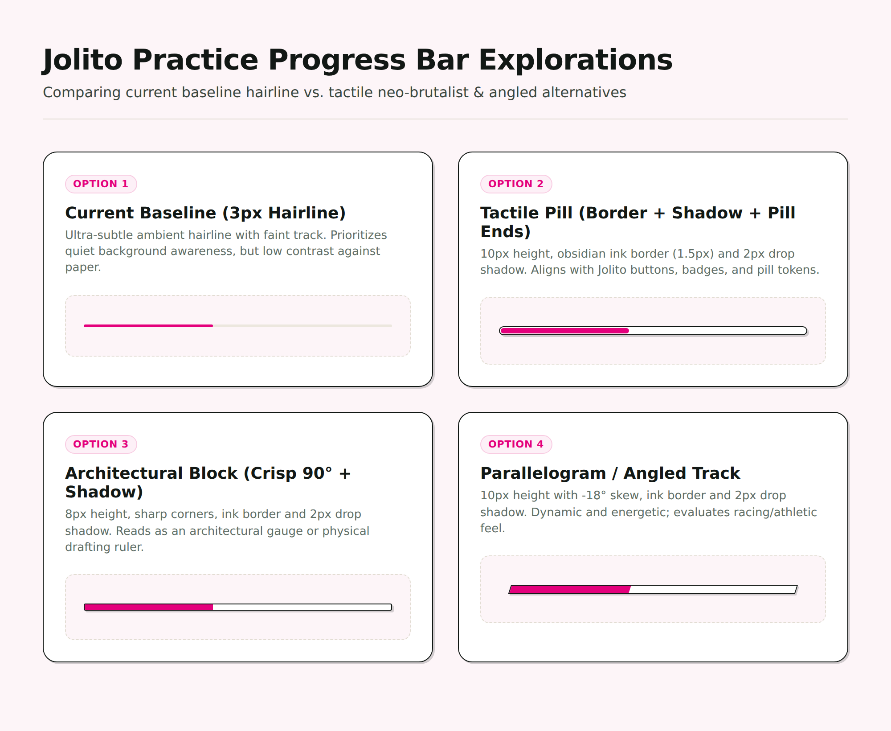
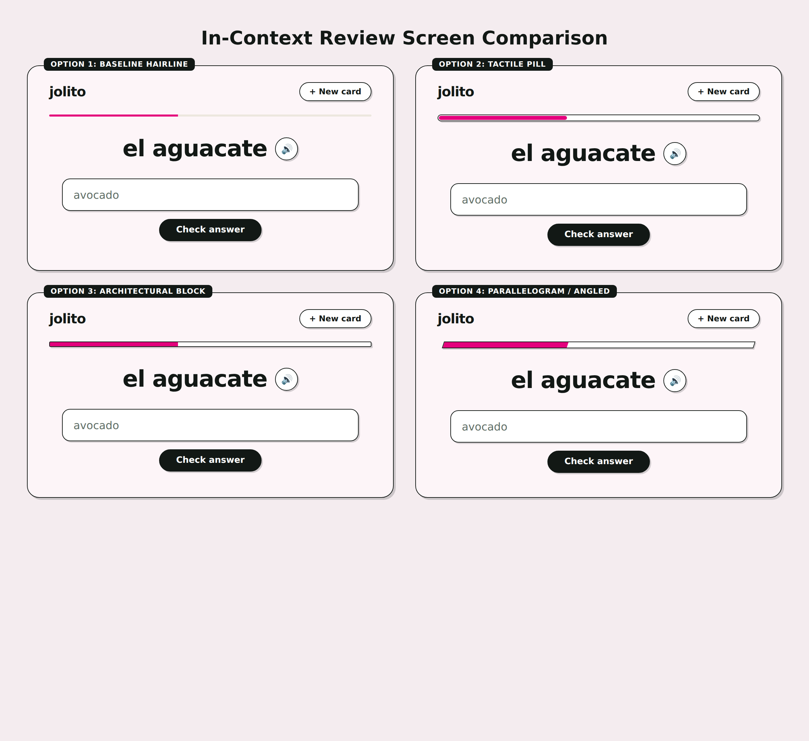
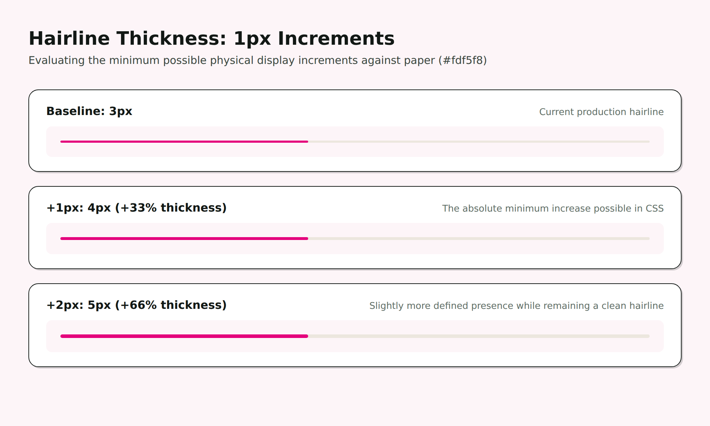

# Jolito Practice Progress Bar Explorations

This document explores design variations for the review session progress bar in Jolito, examining the balance between ambient calm and tactile brand consistency.

## 1. Direct Component Comparison

### Summary of Variants

1. **Option 1: Current Baseline Hairline**
   - **Height:** 3px
   - **Styling:** Faint borderless track (`--line-light` on `--paper`), `--rosa` fill, rounded ends (`--pill-radius`).
   - **Strengths:** Ultra-ambient; never distracts from the flashcard prompt.
   - **Trade-offs:** Low contrast (nearly invisible track on paper); visually detached from the rest of Jolito's tactile neo-brutalist grammar.

2. **Option 2: Tactile Neo-Brutalist Pill**
   - **Height:** 10px
   - **Styling:** Pill radius (`999px`), 1.5px ink border (`--line`), 2px hard offset shadow (`--shadow-sm`).
   - **Strengths:** 100% consistent with Jolito's existing design language (buttons, cards, and pills); clearly communicates track length.
   - **Trade-offs:** Slightly more visual presence than a hairline, but remains clean and quiet.

3. **Option 3: Architectural Block**
   - **Height:** 8px
   - **Styling:** Crisp 90° corners (or minimal 2px radius), 1.5px ink border, 2px hard offset shadow.
   - **Strengths:** Reads like an architectural drafting ruler or tactile analog gauge.
   - **Trade-offs:** Sharp edges diverge slightly from Jolito's pill motif.

4. **Option 4: Parallelogram / Angled Track**
   - **Height:** 10px
   - **Styling:** `-18°` skew, 1.5px ink border, 2px hard offset shadow.
   - **Strengths:** High character, dynamic, breaks out of standard UI rectangular monotony.
   - **Trade-offs:** Connotes racing/athletics/arcade gaming; diagonal edges create slivers at 0-5% and 95-100% progress.

---

## 2. In-Context Screen Comparison

This comparison places each progress bar directly above the study card to evaluate how much visual weight each variant draws relative to the main prompt and answer field.

---

## 3. Hairline Thickness: 1px Increments

* **3px (Baseline):** The ultra-subtle baseline.
* **4px (+1px bump):** The minimum possible physical increase on a pixel grid (+33% volume). Retains 100% of the quiet ambient character while slightly improving edge definition against the paper canvas.
* **5px (+2px bump):** Noticeable step up (+66% volume), slightly clearer track boundary.

