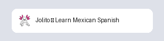
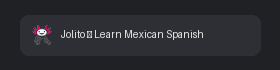
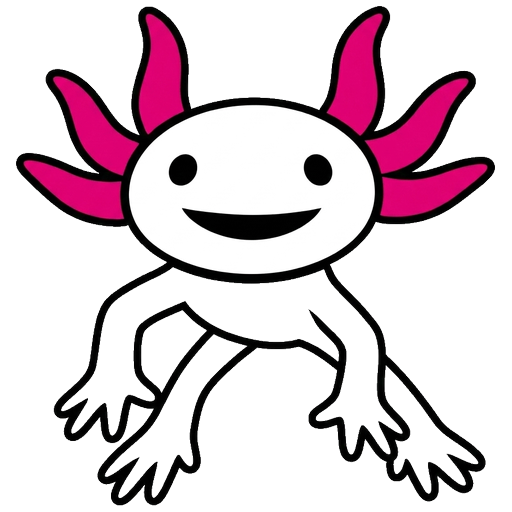

# 🎨 Jolito Favicon (Option 1: Bold Outlined Free-Floating Mascot)

Updated with:

- **Bug fix**: Transparent negative space between the left arm, legs, and torso.
- **Line weight upgrade**: Increased black ink stroke thickness across all body and limb contours for sharp readability at 16×16 px.

---

## 🖥 Real-Scale Browser Tab Simulations

### ☀️ Light Mode Browser Tab

### 🌙 Dark Mode Browser Tab

---

## 🔍 Size Breakdown

|                  512×512 Master                  |                 64×64 Preview                  |                 32×32 Favicon                  |                 16×16 Favicon                  |
| :----------------------------------------------: | :--------------------------------------------: | :--------------------------------------------: | :--------------------------------------------: |
|  |  |  |  |
