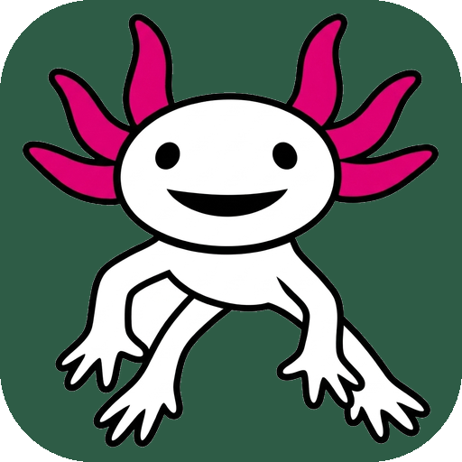

# 🎨 Jolito Favicon: 4 Options Comparison

Comparing all 4 favicon directions starting from our new official Jolito logo:

---

## 🖥 Browser Tab Simulations (Real Scale)

### ☀️ Light Mode Browser Tabs

### 🌙 Dark Mode Browser Tabs

---

## 🔍 Side-by-Side Size Comparison

| Option                                                                                                   |                     512×512 Master                      |                     64×64 Preview                     |                     32×32 Favicon                     |                     16×16 Favicon                     |
| :------------------------------------------------------------------------------------------------------- | :-----------------------------------------------------: | :---------------------------------------------------: | :---------------------------------------------------: | :---------------------------------------------------: |
| **Option 1: As-Is (Full Mascot)** • 100% parity with brand logo • Transparent background           |         |         |         |         |
| **Option 2: Head & Crown Crop** • **2.5× larger face & smile** • High-expression micro readability |     |     |     |     |
| **Option 3: Chunky Micro Mascot** • Full swimming pose • Thickened limbs for 16px weight           |  |  |  |  |
| **Option 4: Mexican Jade Badge** • Solid `#2E5C46` squircle container • Classic app-icon framing   |    |    |    |    |
